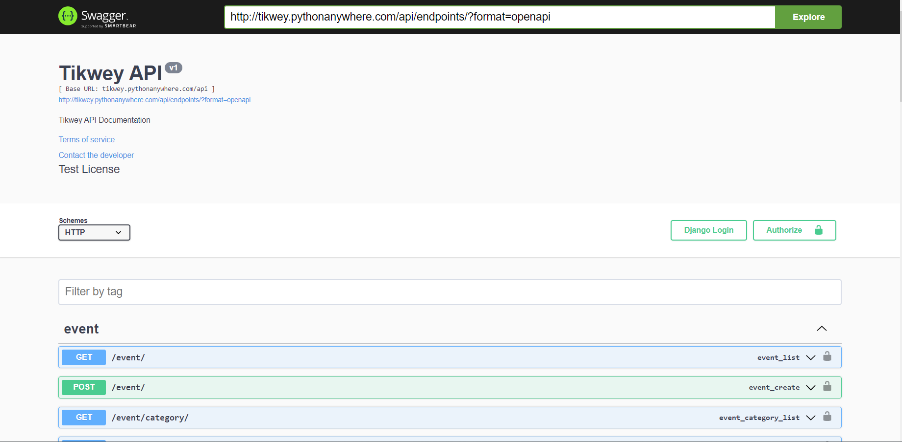
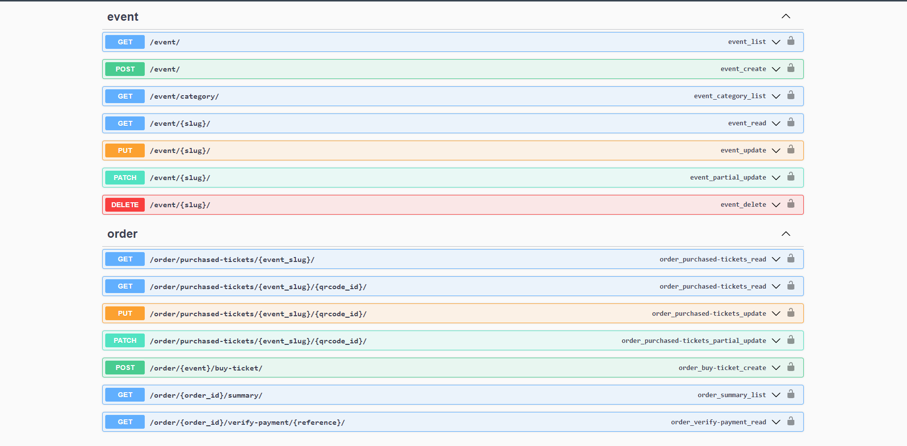

# Event Ticket App

 
 

<table>
  <tr>
    <td></td>
    <td></td>
  </tr>
</table>
 

 

<b>An Event Management App API</b>

 

## ➡️ Description
This is an event management app api created using Django Rest Framework. The project is deployed on pythonanywhere - [Tikwey API](https://tikwey.pythonanywhere.com/api/endpoints) 
The database model structure was carefully mapped out in the db_model.drawio file. 
The main purpose of the app is to buy tickets online. 
This app development was halted due to change in stack and the entire app is being redeveloped using AWS Architecture and React JS. 
Check out ongoing Tikwey app website - [Tikwey](https://www.tikwey.com). 

## ➡️ Features
* Authentication features such as login, logout, register, change and reset password
* Wallet features for each users to deposit money and buy tickets or trade at events
* Purchase ticket features
* View all events available
* Create, update or delete your event when authenticated
  

## ➡️ Languages | Technologies
<table>
  <tr>
    <td>Programming Languages</td>
    <td>Python</td>
  </tr>
  <tr>
    <td>Backend</td>
    <td>Django, Django Rest Framework</td>
  </tr>
  <tr>
    <td>Frontend</td>
    <td>Swagger UI</td>
  </tr>
  <tr>
    <td>Database</td>
    <td>Sqlite3</td>
  </tr>
</table>
 

## ➡️ Installation
* Clone or download this repository
* Ensure python is installed on your system
* Create virtual environment in parent directory, run `python -m venv venv`
* Activate environment, for bash run `source venv/Scripts/activate`
* Install project packages, navigate to requirements folder and run `pip install -r local.txt`
* Migrate database models, run `python manage.py makemigrations`, then `python manage.py migrate`
* Finally start the app, run `python manage.py runserver`
 